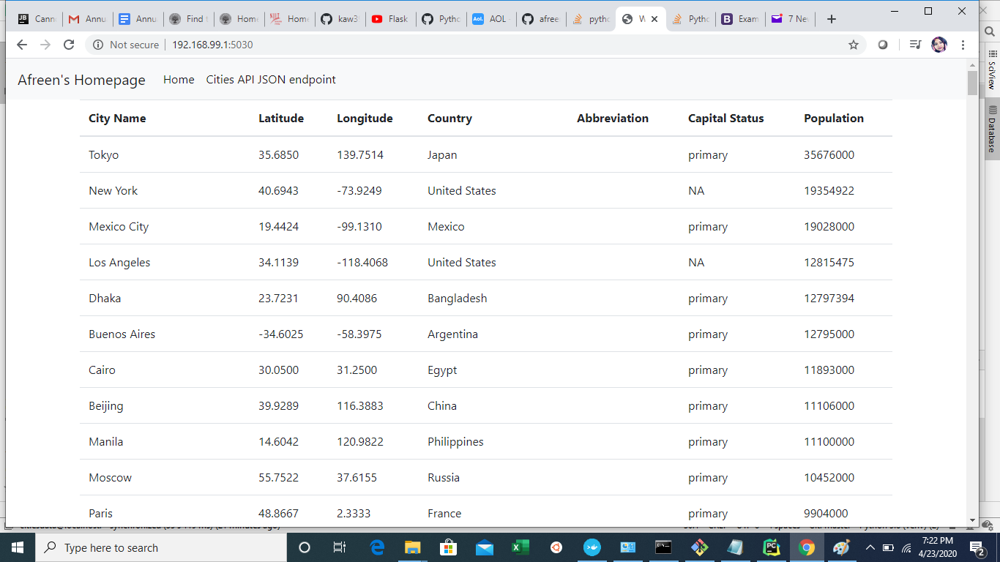

# DockerFlaskPythonMySQLPycharm
This project is a homework assignment to learn how to get Pycharm setup with Docker, Flask, MySQL, and Postman. 

# MySQL database table on Pycharm

# Homepage output on WebApp

# Postman Screenshot
 